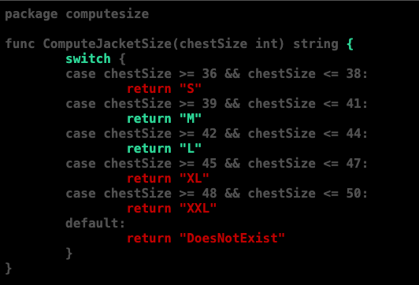
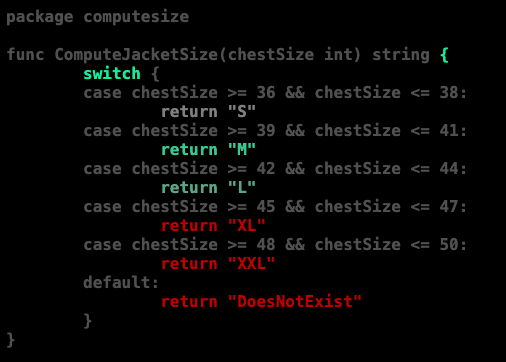

### GoLang Testing: Test Coverage

An ultimate goal of unit testing is early detection of possible issues with the code and making that process automated. For that reason, there are numerous test cases written that test for lots of different scenarios including some rare edge cases. But how to make sure all branches of the code under test are executed and the critical ones are executed even more? One convenient tool that helps with that is a test coverage map. And GoLang provides that capability out of the box so lets look at it.

#### Running A Test with Coverage

To run a test with the coverage option on, simply add `-cover` option. Let's look at our example that validates some code.

computesize.go

```golang
func ComputeJacketSize(chestSize int) string {
	switch {
	case chestSize >= 36 && chestSize <= 38:
		return "S"
	case chestSize >= 39 && chestSize <= 41:
		return "M"
	case chestSize >= 42 && chestSize <= 44:
		return "L"
	case chestSize >= 45 && chestSize <= 47:
		return "XL"
	case chestSize >= 48 && chestSize <= 50:
		return "XXL"
	default:
		return "DoesNotExist"
	}
}
```

computesize_test.go

```golang
func TestComputeSize(t *testing.T) {
	type testData struct {
		chestSize int
		expected string
	}
	tests := []testData{
		{ chestSize: 40, expected: "M" },
		{ chestSize: 42, expected: "L" },
	}
	for _, test := range tests {
		result := ComputeJacketSize(test.chestSize)
		if result != test.expected {
			t.Fatalf("expected size %v but got %v", test.expected, result)
		}
	}
}
```

```bash
$ go test -cover
PASS
coverage: 42.9% of statements
ok  	_/clothing	0.005s
```

That was the simplest way to check the percentage of coverage but that information is limited since it doesn't help us to understand which sections we need to work on in order to enhance the code coverage. Lets run it with another option that can do it. First we run `go test` to generate a file with the coverage info

```bash
$ go test -coverprofile=coverage.out
PASS
coverage: 42.9% of statements
ok  	_/clothing	0.005s
```

Next, we will use the previoiusly generated file and visualize it with the help of `cover` tool

```bash
$ go tool cover -html=coverage.out
```

which will open the detailed html in the browser with our source code highlited with different colors that indicate coverage.



Here we can see which exact lines are covered by the unit test colored with green. But what if we want to have more information in regards how many times some sections highlighted with green were executed? We can do that with `-covermode=count` option. Btw if a concurrent code is tested, there is `-atomic` option for it but it will add some overhead. So let's see what we can get. I modified my test to run some particular branches multiple times:

```golang
tests := []testData{
	{ chestSize: 38, expected: "S" },
	{ chestSize: 40, expected: "M" },
	{ chestSize: 40, expected: "M" },
	{ chestSize: 40, expected: "M" },
	{ chestSize: 40, expected: "M" },
	{ chestSize: 42, expected: "L" },
	{ chestSize: 42, expected: "L" },
}
```



You can now see that some of the branches have a more satured color and some of them have less.